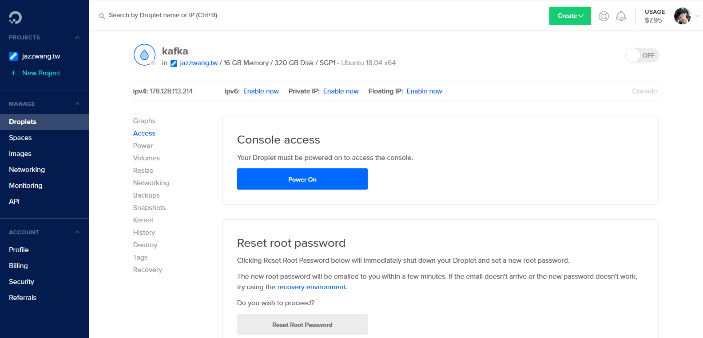
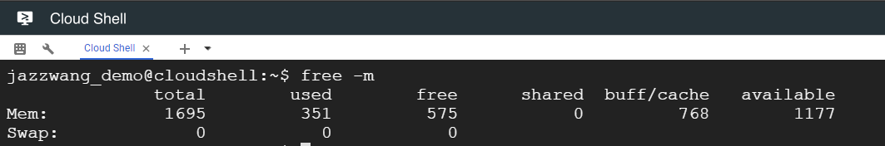
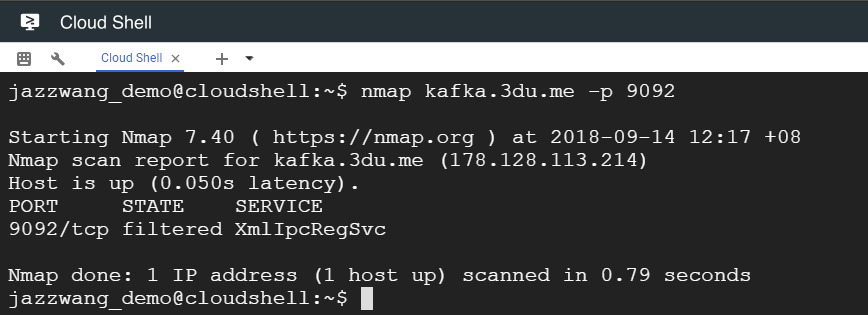
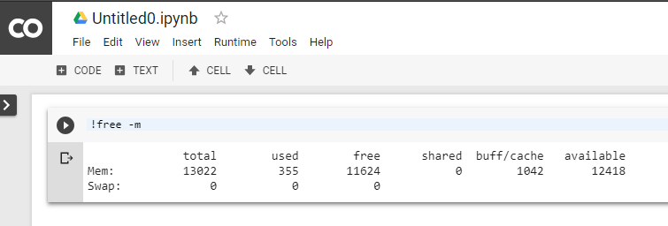

## 實作零

## 準備實作環境

> 淚(累)～  
> 備課就像 DevOps + Data Engineer 面對的現場問題， 
> 永遠存在著許多未知的狀況是無法在一開始就提前想到的 XD

### 展示環境

本次課程的展示環境是使用 DigitalOcean 位於新加坡機房 16 GB 記憶體 Ubuntu 18.04 的虛擬機器。因此，如果您想要類似的環境，可以選擇使用 AWS, GCP, Azure 或 DigitalOcean 等雲服務，或者自行找一台有 8 GB ~ 16 GB 記憶體，搭載 Ubuntu 作業系統的虛擬機器。

圖 1 : DigitalOcean 的展示環境

### 善用免費資源

* 原本有兩個腹案，讓各位可以參與整個課程的互動。
    * [Google Cloud Platform 的 Cloud Shell](https://console.cloud.google.com/cloudshell)
    * [Google Research 的 Colaboratory](https://colab.research.google.com/notebook)

* 真正執行下去才發現，有一些限制：
    * GCP CloudShell 
        * 優點：可以跑 Docker, 有眾多語言的開發環境（Ex. Java, Python, etc.)
        * 缺點：記憶體只有 2GB，網路有較高的限制。
    * Google Colaboratory
        * 優點：記憶體有 14 GB，網路相對比較沒那麼嚴格
        * 缺點：不知道什麼時候會被關掉，不能跑 Docker

圖 2 : GCP CloudShell 只有 2 GB 左右的記憶體

圖 3 : GCP CloudShell 沒辦法連 Kafka 的連線埠

圖 4 : Google Colaboratory 有 14 GB 記憶體，但不能跑 Docker

</cetner>

--------------------
本文件最後更新於：
